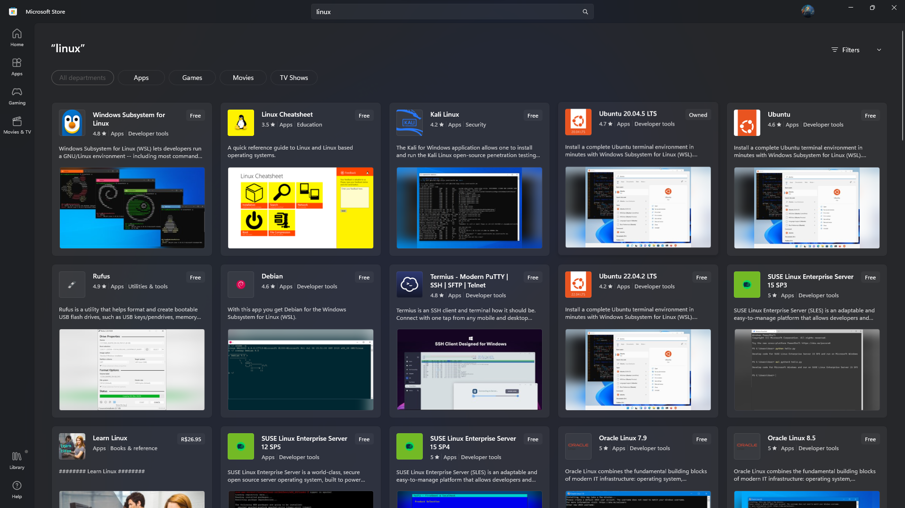

# Guia para instalação WSL, Oh my ZSH + PowerLevel10k

Guia e tutorial para a utilização do Linux dentro do ambiente Windows com plugins e funcionalidades visando a melhor experiência para desenvolvimento.

## Sumário

- [Recomendações Iniciais](#recomendacoes-iniciais)
- [O que é WSL?](#features)
- [Por que usar WSL 2 para desenvolvimento?](#installation)
- [Configuration](#configuration)
- [Fonts](#fonts)
- [Try it in Docker](#try-it-in-docker)
- [License](#license)
- [FAQ](#faq)
- [Troubleshooting](#troubleshooting)

## Recomendações Iniciais

- [Instale uma fonte adequada](#fontes)
- [Cheque se sua máquina tem os requísitos minimos](#requisitos-minimos)
- []
## O que é WSL?

WSL significa "Windows Subsystem for Linux" e é uma camada de compatibilidade dentro do sistema operacional Windows que permite a execução de aplicativos Linux diretamente no Windows, sem a necessidade de uma máquina virtual separada. Isso permite que os usuários executem aplicativos e ferramentas Linux em seus sistemas Windows sem ter que instalar um sistema operacional Linux separado.

No ano de 2019, a Microsoft divulgou uma nova edição do WSL, conhecida como WSL 2. Essa nova versão apresentou melhorias em relação à primeira:

- Capacidade de executar o kernel completo do Linux.
- Melhoria no desempenho de acesso aos arquivos internos do Linux.
- Compatibilidade completa com as chamadas de sistema.
O lançamento oficial do WSL 2 ocorreu em 28 de maio de 2020.

Para entender as diferenças entre as versões, consulte o seguinte link: https://docs.microsoft.com/pt-br/windows/wsl/compare-versions
## Por que usar WSL 2 para desenvolvimento?

Existem várias razões pelas quais o WSL pode ser uma excelente escolha para desenvolvimento de software:

1. **Acesso a ferramentas Linux** - O WSL permite que os desenvolvedores acessem e usem as ferramentas de linha de comando do Linux, muitas das quais são amplamente utilizadas na comunidade de desenvolvimento de software, como o Git, o Vim, o GCC, entre outras. Isso pode ser útil para desenvolvedores que estão acostumados a trabalhar em ambientes Linux e querem continuar usando essas ferramentas no Windows.

2. **Suporte para ambientes de desenvolvimento populares do Linux** - O WSL suporta ambientes de desenvolvimento populares do Linux, como o Ruby on Rails, o Node.js e o Python. Isso significa que os desenvolvedores podem continuar usando esses ambientes de desenvolvimento populares sem ter que mudar para o Linux.

3. **Facilidade de configuração** - O WSL é fácil de configurar e usar, e os desenvolvedores podem instalar rapidamente suas ferramentas de desenvolvimento favoritas, sem ter que passar por todo o processo de configuração de um ambiente Linux completo.

4. **Compatibilidade com o Windows** - O WSL permite que os desenvolvedores usem o Windows como plataforma de desenvolvimento sem sacrificar a compatibilidade com o Windows. Isso significa que os desenvolvedores podem escrever e testar código no Windows e ter certeza de que ele funcionará corretamente quando for implantado em um ambiente de produção do Windows.

Em resumo, o WSL pode ser uma excelente escolha para desenvolvimento de software, permitindo que os desenvolvedores acessem ferramentas Linux, suportem ambientes de desenvolvimento populares do Linux, configurem facilmente seus ambientes de desenvolvimento e garantam a compatibilidade com o Windows.
## Referências

- [Guia rápido do WSL2 + Docker](https://github.com/codeedu/wsl2-docker-quickstart)
- [WSL - Wikipedia](https://en.wikipedia.org/wiki/Windows_Subsystem_for_Linux#:~:text=WSL%202%20requires%20Windows%2011,of%20native%20Ubuntu%2020.04%20LTS.)
## Instalação do WSL 2

> ## Windows 11
Para instalar o WSL no Windows 11 ou Windows 10 na versão 2004 ou superior basta somente abrir um PowerShell ou um Prompt de comando e digitar
```bash
 wsl --install
```
Este comando irá instalar todas as dependências do WSL instalando o Ubuntu como o Linux padrão.

Se você quiser instalar uma distribuição diferente, execute o comando `wsl -l -o` , será listado todas as versões de Linux disponíveis. Instale a versão escolhida com o comando `wsl --install -d nome-da-distribuicao`.

Recomendamos manter-se com Ubuntu por ser uma distribuição popular e que já vem com diversas ferramentas pre-instaladas

> ## Windows 10
Caso você esteja em uma versão mais antiga do Windows 10, execute os seguintes comandos no PowerShell em modo administrador:

``` bash
dism.exe /online /enable-feature /featurename:Microsoft-Windows-Subsystem-Linux /all /norestart
dism.exe /online /enable-feature /featurename:VirtualMachinePlatform /all /norestart
```

Abra o PowerShell e digite o comando `wsl`, se não funcionar reinicie sua máquina.

#### Definindo WSL 2 como sua versão padrão
Abra o Terminal/PowerShell e execute este comando:
```bash
wsl --set-default-version 2
```

### Instalar o .exe do WSL
Faça o download do Kernel 2 do WSL 2 nesse link: [https://docs.microsoft.com/pt-br/windows/wsl/wsl2-kernel](https://docs.microsoft.com/pt-br/windows/wsl/wsl2-kernel) e instale o pacote.

## Escolha sua distro pela Microsoft Store

